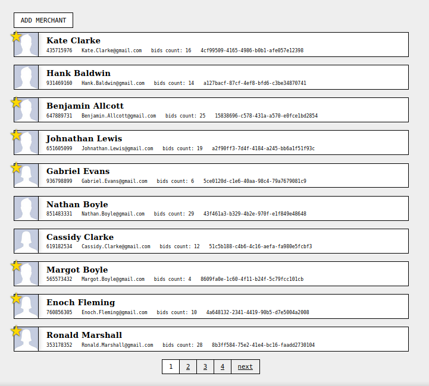

# Manage merchants

[Task description](auto1-frontend-test-task.md)



## Install and run

For better experience please install and use [nvm](https://github.com/nvm-sh/nvm#install--update-script).

```sh
$ nvm use      # to set proper node version
$ npm i        # to install dependencies
$ npm start    # to run project on localhost:3000
```
